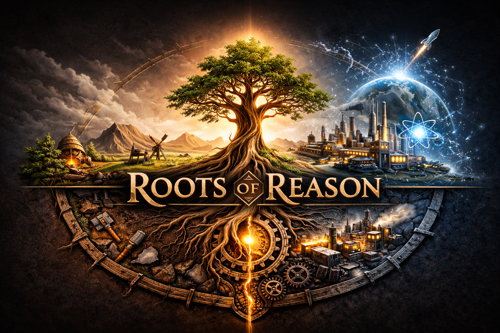

  

# Roots of Reason

A civilization RTS inspired by Age of Empires where the endgame is achieving artificial general intelligence. Built with Godot 4 + GDScript, 2D isometric, single-player vs AI.

## Features

- **7 Ages of progression** — Stone → Bronze → Iron → Medieval → Industrial → Information → Singularity
- **3 civilizations** — Mesopotamia (builder), Rome (military), Polynesia (naval)
- **Knowledge Burning** — lose your most recent tech when a Town Center falls
- **River transport** — build docks and ship resources downstream via attackable barges
- **Wolf domestication** — hunt wolves for food or invest to gain loyal dog companions
- **Victory conditions** — Conquest, Singularity (complete AGI Core), or Wonder

## Getting Started

1. Install [Godot 4.6](https://godotengine.org/download)
2. Clone this repo and open `project.godot`
3. Press F5 to run the prototype scene

## License

All rights reserved.
